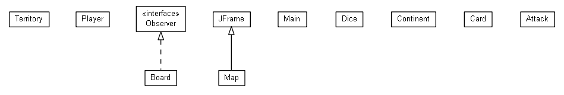

# RISK
### COSC 4353, Dr. Alipour
### Team members: Payne Wheat, Patricia Sieng, Haoxian Lin

Current Build Status

Code Coverage

[Risk Rules](https://www.hasbro.com/common/instruct/risk.pdf)

## UML

## Description:
    You will implement Risk game; 
    description of the game is available at: (http://www.ultraboardgames.com/risk/index.php). 
    Your program should support  N={2,3,4,5,6} players. 
    Your program will prompt users to enter new actions. 
    You will use Java programming language to implement the game. 
    Please note that during the semester there will be assignments to add new features to your program, 
    thus it is important to implement the core functionality by the end of fourth week of the class. 

## Installing Maven
Maven needs to run locally in order to perform tests prior to the build on Travis CI.

### For Windows:
[How to install Maven](https://www.mkyong.com/maven/how-to-install-maven-in-windows/)

## AWS Dependencies
Email me at pewheat@uh.edu to receive the API secret keys. I will send this as a properties file, secrets_PHP.prop, which you will need to put in the root folder of the project. To prevent the secret keys from being pushed to the repo, be sure to exclude the file using .gitignore. [More about gitignore](https://help.github.com/articles/ignoring-files/)

Once you have the properties file in place, checkout a new branch locally (git checkout -b aws), pull from the aws branch in this repository (git pull origin aws), and set your build path to include the jar files in /lib/. To do this in Eclipse, right click on the project in project explorer > Build Path > Configure Build Path > Click the Libraries tab > Add Class Folder...
Then select /lib/

Once everyone has the necessary dependencies in place, I will merge the aws branch with master.

For the time being, if you need to create a Board object in any of your tests, set the 'useAWS' parameter in the board constructor as false (until I have Travis CI working with AWS dependencies).

[riskmap]: https://static1.squarespace.com/static/563fc40de4b06686c7220979/t/5658b45ce4b05e0c71b95004/1448653925676/?format=1500w
![alt text][riskmap]

## Risk Cards
42 Territory Cards, 2 ‘wild’ cards  
- Each card has a type of either infantry, cavalry, or artillery and one of the territories.
- Wild card has all three types and no territory

At the end of any turn in which the player has captured at least one territory, they will earn one (and only one) RISK card [source](http://www.ultraboardgames.com/risk/game-rules.php).

**Card objective**: collect a set of 3 cards containing the following combinations.
- 3 cards of the same type (infantry, artillery, or cavalry)  
- 1 card of each 3 types  
- Or any 2 plus a “wild” card  

## Trading Cards In
At the beginning of each player’s turn, if they have a set of cards that can be turned in, the player may turn in the 3 cards for for a number of armies as follows:  
- 1st set: 4 armies  
- 2nd set: 6 armies  
- 3rd set: 8 armies  
- 4th set: 10 armies  
- 5th set: 12 armies  
- 6th set: 15 armies  
- 7th set: 20 armies  
- 8th+ sets: 20 + (set# - 7) * 5  (8th set receives 25, 9th receives 30, 10th receives 35, …)

If any of the 3 cards turned in has a territory the player is currently occupying, the player receives an additional 2 armies on that territory.

----

## Continents and Territories:
[source](https://en.wikipedia.org/wiki/Risk_(game))

**Continent (Rewarded Armies)**

**North America (5)**
- Alaska
- Alberta (Western Canada)
- Central America
- Eastern United States
- Greenland
- Northwest Territory
- Ontario (Central Canada)
- Quebec (Eastern Canada)
- Western United States

**South America (2)**
- Argentina
- Brazil
- Peru
- Venezuela

**Europe (5)**
- Great Britain (Great Britain & Ireland)
- Iceland
- Northern Europe
- Scandinavia
- Southern Europe
- Ukraine (Eastern Europe, Russia)
- Western Europe

**Africa (3)**
- Congo (Central Africa)
- East Africa[note 1]
- Egypt
- Madagascar
- North Africa
- South Africa

**Asia (7)**
- Afghanistan[note 2]
- China
- India (Hindustan)
- Irkutsk
- Japan
- Kamchatka
- Middle East[note 1]
- Mongolia
- Siam (Southeast Asia)
- Siberia
- Ural
- Yakutsk

**Australia (2)**
- Eastern Australia
- Indonesia
- New Guinea
- Western Australia

